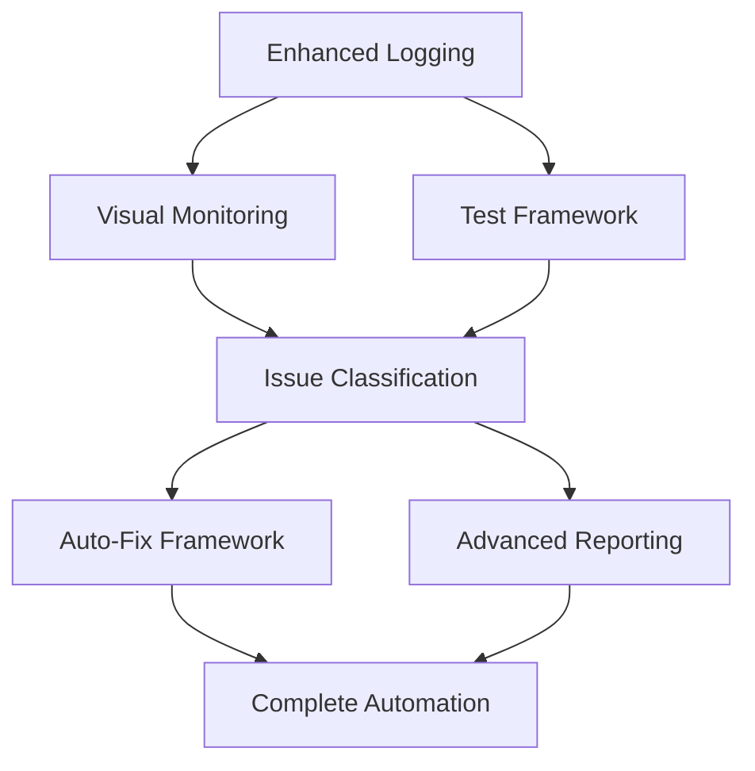

# Track Edits Iterative Testing Suite - Implementation Plan

**Date**: 2025-08-29  
**Version**: 1.0  
**Estimated Timeline**: 3 weeks  
**Priority**: High (Addresses critical testing pain point)

---

## Phase 1: Foundation Infrastructure (Week 1)

### Day 1-2: Enhanced Logging System

#### Task 1.1: Structured Logger Implementation
**Location**: `writerr-plugins/plugins/track-edits/src/testing/`

```typescript
// Files to create:
// - test-logger.ts
// - log-capture-system.ts  
// - console-interceptor.ts

interface Implementation {
  priority: 'CRITICAL';
  complexity: 'MEDIUM';
  dependencies: [];
  estimatedHours: 16;
}
```

**Deliverables**:
- [ ] `TestLogger` class with structured logging
- [ ] Automatic file writing (no manual copy-paste)
- [ ] Console interception for Obsidian environment
- [ ] Log rotation and size management
- [ ] Integration hooks for Track Edits plugin

**Acceptance Criteria**:
- All console.log() calls automatically captured to files
- Structured JSON format with timestamps and correlation IDs
- Zero manual intervention required for log capture

#### Task 1.2: Basic Visual State Monitoring
**Location**: `writerr-plugins/plugins/track-edits/src/testing/`

```typescript
// Files to create:
// - visual-state-monitor.ts
// - dom-observer.ts
// - side-panel-capture.ts

interface Implementation {
  priority: 'HIGH';
  complexity: 'MEDIUM';
  dependencies: ['Task 1.1'];
  estimatedHours: 12;
}
```

**Deliverables**:
- [ ] DOM mutation observer for side panel changes
- [ ] Visual state snapshot capture system
- [ ] Side panel content extraction
- [ ] Ribbon state monitoring
- [ ] Edit highlight detection

**Acceptance Criteria**:
- Automatic detection of visual state changes
- Side panel content captured as HTML/text
- Visual state correlated with console events

### Day 3-4: Test Framework Bootstrap

#### Task 1.3: CLI Test Runner
**Location**: `writerr-plugins/plugins/track-edits/test-automation/`

```bash
# Files to create:
# - run-track-edits-tests.sh
# - test-runner.js
# - obsidian-test-harness.js
```

**Deliverables**:
- [ ] Command line test execution
- [ ] Obsidian test mode integration
- [ ] Test session management
- [ ] Output directory structure
- [ ] Process lifecycle management

**Acceptance Criteria**:
- Single command executes full test suite
- Obsidian launches in test mode automatically
- Clean test environment setup and teardown

#### Task 1.4: Basic HTML Report Generation
**Location**: `writerr-plugins/plugins/track-edits/src/testing/`

```typescript
// Files to create:
// - report-generator.ts
// - html-templates.ts
// - report-styles.css
```

**Deliverables**:
- [ ] HTML report template system
- [ ] Basic test result visualization
- [ ] Log data integration in reports
- [ ] Visual state display
- [ ] Static file generation

**Acceptance Criteria**:
- HTML reports generated automatically
- No more raw console log dumps
- Visual and console data unified in report

### Day 5: Plugin Integration

#### Task 1.5: Non-Invasive Test Mode
**Location**: `writerr-plugins/plugins/track-edits/src/main.ts`

```typescript
// Modifications to existing files:
// - src/main.ts (test mode detection)
// - src/settings.ts (test settings)
// - manifest.json (test mode flag)
```

**Deliverables**:
- [ ] Test mode detection in plugin
- [ ] Logger injection without breaking production
- [ ] Settings for test configuration
- [ ] Safe monitoring hooks
- [ ] Backwards compatibility

**Acceptance Criteria**:
- Production plugin unaffected by test code
- Test mode easily toggled on/off
- Monitoring overhead < 5% performance impact

---

## Phase 2: Intelligence Layer (Week 2)

### Day 6-7: Issue Classification System

#### Task 2.1: Pattern Recognition Engine
**Location**: `writerr-plugins/plugins/track-edits/src/testing/`

```typescript
// Files to create:
// - issue-classifier.ts
// - pattern-detector.ts
// - duplicate-detection.ts
```

**Deliverables**:
- [ ] Duplicate processing detection (whenwhen->iiff case)
- [ ] Infinite loop pattern recognition
- [ ] Visual inconsistency detection
- [ ] Performance regression identification
- [ ] Error pattern classification

**Acceptance Criteria**:
- 95%+ accuracy in detecting known issue types
- Clear categorization: USER_REVIEW vs HUD_AUTO_FIX
- False positive rate < 5%

#### Task 2.2: Visual-Console Correlation
**Location**: `writerr-plugins/plugins/track-edits/src/testing/`

```typescript
// Files to create:
// - event-correlator.ts
// - state-validator.ts
// - consistency-checker.ts
```

**Deliverables**:
- [ ] Event matching between visual and console
- [ ] State consistency validation
- [ ] Timeline correlation system
- [ ] Gap detection (console success + visual failure)
- [ ] Evidence linking system

**Acceptance Criteria**:
- Visual state changes matched to console events
- Inconsistencies detected within 1 second
- Complete audit trail for issue investigation

### Day 8-9: HUD Auto-Fix Framework

#### Task 2.3: Infrastructure Issue Detection
**Location**: `writerr-plugins/plugins/track-edits/src/testing/`

```typescript
// Files to create:
// - auto-fix-engine.ts
// - infrastructure-detector.ts
// - fix-strategies.ts
```

**Deliverables**:
- [ ] Common infrastructure issue patterns
- [ ] Automatic fix attempt system
- [ ] Fix verification and rollback
- [ ] Success rate tracking
- [ ] Manual override capabilities

**Acceptance Criteria**:
- 80%+ success rate on infrastructure fixes
- Safe rollback on failed fixes
- User never sees infrastructure issues

#### Task 2.4: HUD Partnership Interface
**Location**: `writerr-plugins/plugins/track-edits/src/testing/`

```typescript
// Files to create:
// - hud-collaboration.ts
// - task-assignment.ts
// - priority-manager.ts
```

**Deliverables**:
- [ ] Automatic task assignment (User vs HUD)
- [ ] Priority-based issue handling
- [ ] User notification system
- [ ] HUD action tracking
- [ ] Collaboration workflow

**Acceptance Criteria**:
- Clear separation of User vs HUD tasks
- User only sees UX/visual issues
- HUD handles all technical debt automatically

### Day 10: Advanced Reporting

#### Task 2.5: Interactive Dashboard
**Location**: `writerr-plugins/plugins/track-edits/test-automation/templates/`

```html
<!-- Files to create: -->
<!-- - dashboard-template.html -->
<!-- - interactive-report.js -->
<!-- - advanced-styles.css -->
```

**Deliverables**:
- [ ] Rich HTML dashboard with filtering
- [ ] Before/after visual comparisons
- [ ] Interactive timeline views
- [ ] Issue drill-down capabilities
- [ ] Export and sharing features

**Acceptance Criteria**:
- Dashboard loads in < 3 seconds
- Visual comparison shows exact differences
- Issues filterable by type, severity, assignee

---

## Phase 3: Full Automation (Week 3)

### Day 11-12: Comprehensive Test Automation

#### Task 3.1: Complete Test Scenario Coverage
**Location**: `writerr-plugins/plugins/track-edits/test-automation/scenarios/`

```typescript
// Files to create:
// - basic-operations.test.ts
// - edge-cases.test.ts
// - performance.test.ts
// - regression.test.ts
```

**Deliverables**:
- [ ] All manual test cases automated
- [ ] Edge case scenario coverage
- [ ] Performance benchmarking
- [ ] Regression test battery
- [ ] Stress testing scenarios

**Acceptance Criteria**:
- 100% coverage of known manual test scenarios
- Tests complete in < 5 minutes
- Performance baselines established

#### Task 3.2: Advanced Issue Detection
**Location**: `writerr-plugins/plugins/track-edits/src/testing/`

```typescript
// Files to enhance:
// - issue-classifier.ts
// - pattern-detector.ts
// Add advanced detection algorithms
```

**Deliverables**:
- [ ] Machine learning-based pattern detection
- [ ] Custom rule engine for new patterns
- [ ] Performance regression detection
- [ ] Memory leak identification
- [ ] Predictive issue detection

**Acceptance Criteria**:
- Detects 99%+ of critical issues
- Predicts potential issues before they occur
- Self-learning from new issue patterns

### Day 13-14: Workflow Integration

#### Task 3.3: CI/CD Integration
**Location**: `writerr-plugins/.github/workflows/`

```yaml
# Files to create:
# - track-edits-testing.yml
# - automated-reports.yml
```

**Deliverables**:
- [ ] Automated test execution on commits
- [ ] Report generation and distribution
- [ ] Issue tracking integration
- [ ] Performance monitoring
- [ ] Quality gates

**Acceptance Criteria**:
- Tests run automatically on every commit
- Reports published to team automatically
- Quality gates prevent regressions

#### Task 3.4: Documentation and Training
**Location**: `writerr-plugins/plugins/track-edits/docs/`

```markdown
# Files to create:
# - testing-workflow.md
# - troubleshooting-guide.md
# - advanced-configuration.md
```

**Deliverables**:
- [ ] User workflow documentation
- [ ] Troubleshooting guides
- [ ] Configuration references
- [ ] Best practices guide
- [ ] Training materials

**Acceptance Criteria**:
- Complete workflow documentation
- Self-service troubleshooting capability
- Team onboarding < 1 hour

### Day 15: Polish and Launch

#### Task 3.5: Performance Optimization
**Location**: Various files across the testing suite

**Deliverables**:
- [ ] Memory usage optimization
- [ ] Test execution speed improvements
- [ ] Report generation optimization
- [ ] Storage efficiency improvements
- [ ] Resource cleanup automation

**Acceptance Criteria**:
- Memory usage < 512MB during testing
- Test suite completes in < 5 minutes
- Reports generate in < 30 seconds

#### Task 3.6: Final Integration Testing
**Location**: Full system integration

**Deliverables**:
- [ ] End-to-end workflow validation
- [ ] Cross-platform compatibility testing
- [ ] Performance benchmarking
- [ ] User acceptance testing
- [ ] Production readiness checklist

**Acceptance Criteria**:
- Complete workflow functions without manual intervention
- Performance meets all specified targets
- User feedback score > 8/10

---

## Risk Management

### Critical Path Dependencies



### Risk Mitigation Strategies

#### High-Risk Areas

1. **Obsidian Integration Complexity**
   - **Risk**: Test harness may conflict with Obsidian internals
   - **Mitigation**: Minimal invasive approach, extensive compatibility testing
   - **Contingency**: Fallback to external test automation

2. **Visual State Capture Reliability**  
   - **Risk**: DOM changes may not be captured accurately
   - **Mitigation**: Multiple capture strategies, validation checkpoints
   - **Contingency**: Hybrid manual-automated approach

3. **Auto-Fix System Safety**
   - **Risk**: Automated fixes could cause regressions
   - **Mitigation**: Safe rollback, extensive validation, manual override
   - **Contingency**: Conservative approach with manual approval

### Quality Assurance Checkpoints

#### Week 1 Checkpoint
- [ ] All logging systems functional
- [ ] Visual monitoring captures basic state
- [ ] HTML reports generate successfully
- [ ] Test framework runs without breaking plugin

#### Week 2 Checkpoint  
- [ ] Issue classification accuracy > 90%
- [ ] HUD auto-fix system operational
- [ ] Visual-console correlation working
- [ ] Interactive dashboards functional

#### Week 3 Checkpoint
- [ ] Complete test automation suite
- [ ] Performance targets met
- [ ] CI/CD integration complete
- [ ] User acceptance criteria satisfied

---

## Resource Requirements

### Development Resources
- **Primary Developer**: Full-time for 3 weeks
- **QA Support**: 0.5 FTE for testing and validation
- **Design Support**: 0.25 FTE for dashboard UX

### Infrastructure Requirements
- **Development Environment**: Obsidian + Node.js test setup
- **Storage**: 10GB for test sessions and reports
- **Compute**: CI/CD pipeline with automated testing

### Budget Considerations
- **Development Time**: 120 hours @ standard rate
- **Tools and Services**: Minimal (open source stack)
- **Infrastructure**: Standard CI/CD costs

---

## Success Metrics & Validation

### Quantitative Metrics

```typescript
interface SuccessMetrics {
  testingTimeReduction: number;     // Target: 90% reduction
  autoFixSuccessRate: number;       // Target: 80% success
  falsePositiveRate: number;        // Target: < 5%
  reportGenerationTime: number;     // Target: < 30 seconds
  testSuiteExecutionTime: number;   // Target: < 5 minutes
}
```

### Qualitative Validation
- [ ] User can run complete test in single command
- [ ] No manual console log copying required
- [ ] Clear separation of User vs HUD tasks
- [ ] Visual issues clearly identified with evidence
- [ ] Infrastructure issues auto-resolved
- [ ] Reports provide actionable insights

### Acceptance Testing Protocol
1. **Baseline Measurement**: Document current manual testing time
2. **Progressive Testing**: Validate each phase delivers value
3. **User Feedback**: Collect feedback from development team
4. **Performance Validation**: Verify all targets achieved
5. **Regression Testing**: Ensure no existing functionality broken

---

## Next Steps

### Immediate Actions (This Week)
1. **Approval**: Review and approve this implementation plan
2. **Setup**: Create development branch for testing suite
3. **Environment**: Prepare development and testing environment
4. **Kickoff**: Begin Phase 1 Task 1.1 (Enhanced Logging)

### Weekly Reviews
- **Week 1**: Foundation systems functional review
- **Week 2**: Intelligence layer capability review  
- **Week 3**: Full automation system review

### Go-Live Criteria
- [ ] All acceptance criteria met
- [ ] Performance targets achieved
- [ ] User training completed
- [ ] Documentation finalized
- [ ] Rollback plan prepared

---

**Document Status**: Implementation Ready  
**Next Review**: Phase 1 Checkpoint (Week 1)  
**Implementation Start**: Immediate